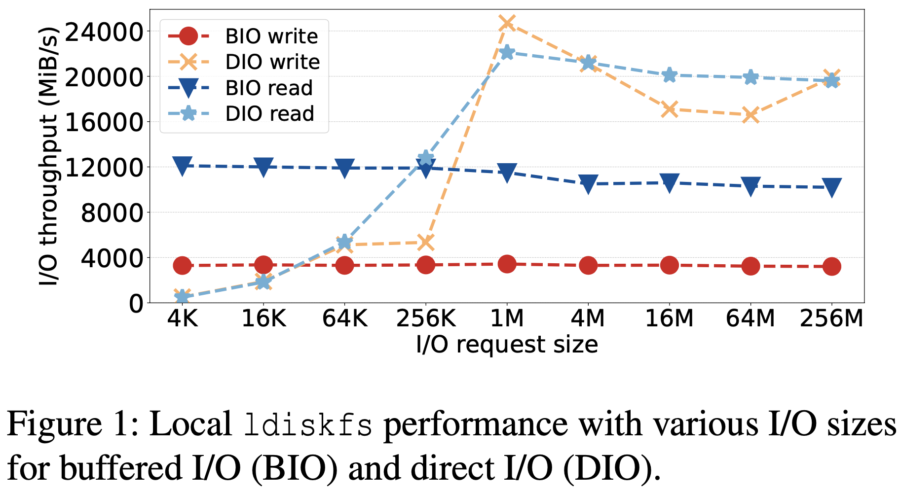
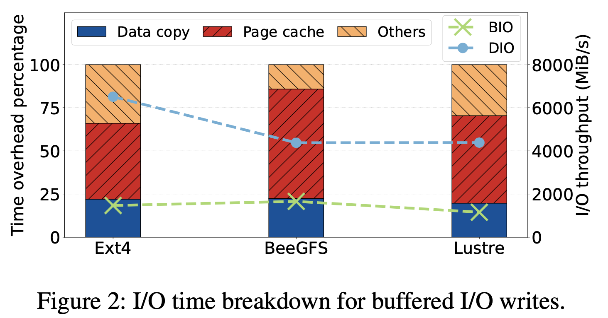
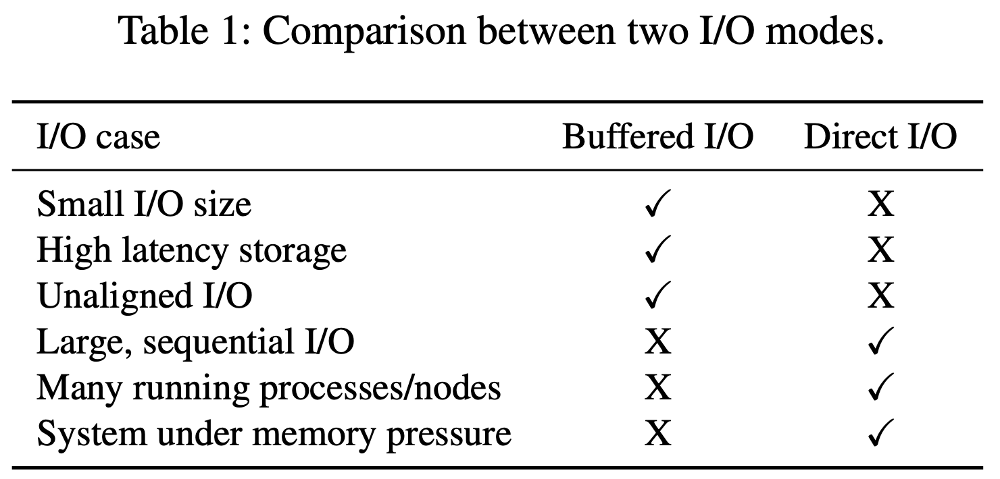
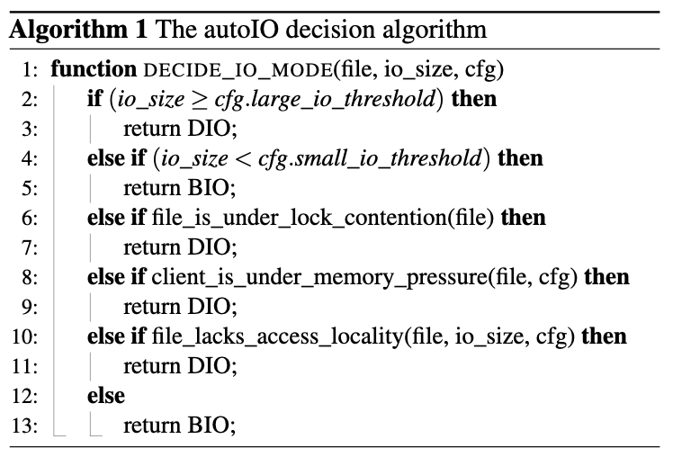
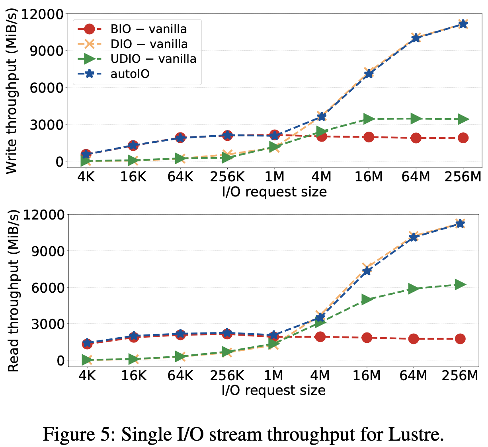
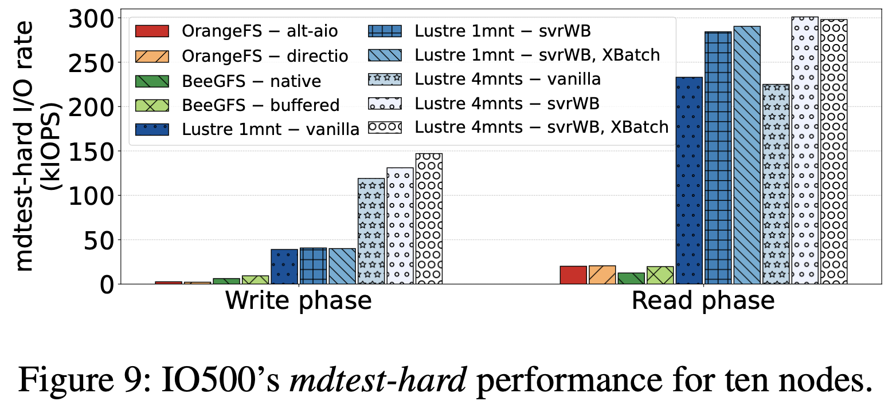
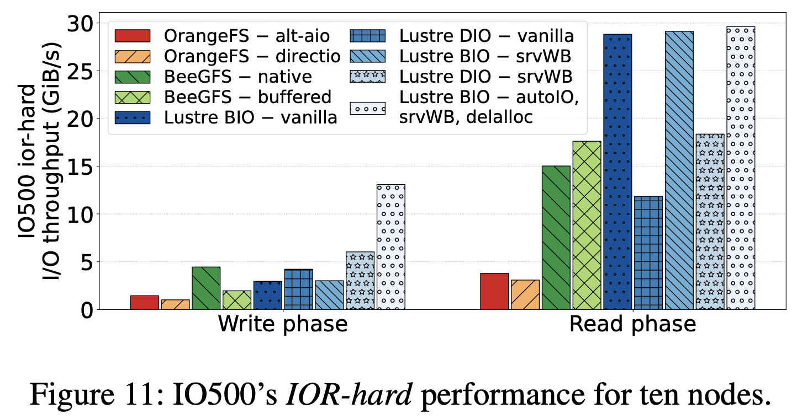

> Qian Y, Vef M A, Farrell P, et al. **Combining Buffered {I/O} and Direct {I/O} in Distributed File Systems**[C]//22nd USENIX Conference on File and Storage Technologies (FAST 24). 2024: 17-33.

### 问题

在Linux中，有两种I/O模式：

* buffered I/O：将读写操作的数据缓存在页缓存中。配合预读和回写，buffered I/O可以极大地提高I/O性能。

* direct I/O：在打开文件时指定***O_DIRECT***标志，可以绕开页缓存。但它要求缓冲区的长度和起始地址、文件的偏移量必须满足对齐要求。具体来说，I/O大小和文件偏移量必须是512字节的倍数，而缓冲区的起始地址也必须是512字节对齐。

对于分布式文件系统，什么时候应该使用哪种I/O模式呢？

从上图可以发现：对于小I/O请求，buffered I/O的性能始终高于direct I/O；而对于大I/O请求，direct I/O则优于buffered I/O。

此外，页缓存引入了额外的数据拷贝，其管理需要执行页分配、加锁、页回收等操作。

从上图可以发现：这些文件系统将大约20%的时间花费在应用和页缓存之间的数据拷贝上，而超过40%的时间则花费在页缓存的管理上。

因此，这两种I/O模式的对比如下表所示：

### 方法

* autoIO决策算法：同时考虑I/O请求大小、锁竞争、内存压力、访问局部性，以便决定采用buffered I/O还是direct I/O。

* 自适应的服务端回写缓存（缩写为svrWB）：默认情况下，Lustre服务端会使用直写模式；而对于小的I/O请求（ < 64KiB），Lustre服务端则切换至buffered I/O（回写）模式。
* 针对缓冲写的跨文件批量传输（缩写为XBatch）：将多个小文件的脏页合并传输。
* 不对齐的direct I/O：当用户的缓冲区（用户态）不对齐时，Lustre会在内核中创建一个对齐的缓冲区，并将数据从用户缓冲区拷贝到内核缓冲区中。
* 延迟（块）分配（缩写为delalloc）：默认情况下，在执行写操作时会立即分配块（即使使用了回写模式）。该论文提出延迟数据块的分配，将小的、不连续的I/O请求合并成大的、连续的I/O请求。

### 实验

对比系统：BeeGFS、OrangeFS

测试工具：

* 微基准测试：IOR、mdtest、IO500
* 宏基准测试：mpiFileUtils/dcp 、VPIC-IO（h5bench）
* 真实应用：Nek5000

实验结果：

* 单进程写、读测试：

* 十节点IO500 mdtest-hard性能对比：

* 十节点IO500 IOR-hard性能对比

### 总结

* 该论文提出了客户端的I/O模式决策算法autoIO，能够在buffered I/O和direct I/O之间进行动态切换。autoIO不仅考虑了I/O请求大小，还考虑文件锁竞争、内存限制、访问局部性等。

* 本文还提出了自适应的服务端回写缓存、针对缓冲写的跨文件批量传输、不对齐的direct I/O、延迟（块）分配。

* 与原始的Lustre相比，论文提出的方法吞吐量提高了3x；比其他分布式文件系统相比，吞吐量则提高了13x。

### 启发

* 为了定位瓶颈，可以使用性能分析工具perf去深入分析文件系统的I/O行为。

* 如果应用的访问模式缺乏时间和空间局部性，缓存页不会被复用，则没有缓存的必要。

* 当一个行为存在几种可能时，可以尝试动态决定不同场景下最合适的可能。

### 不足

正如论文中提到的，autoIO算法的阈值（大I/O或者小I/O）是固定的，无法适应不同的负载场景。
